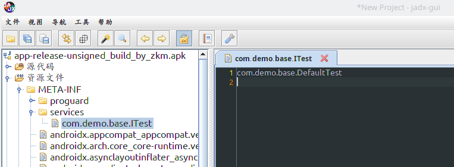
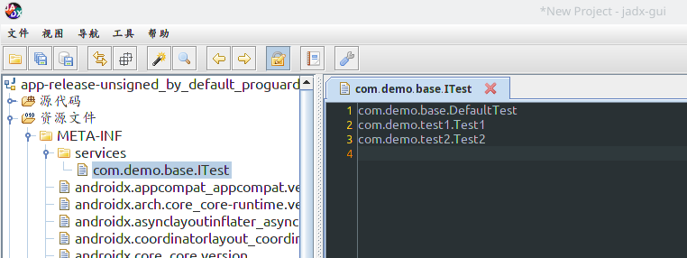

##  ZKM With [AutoService](https://github.com/google/auto/tree/master/service)  question

This problem occurs when using aar to rely on module code, aar uses AutoService to associate interfaces and implementations.

### apk

#### `app-release-unsigned_build_by_zkm.apk`:   build by zkm

step: 

* edit `build.gradle`

```groovy
buildscript {
    repositories {
        flatDir{ dirs 'proguard'}
        google()
        jcenter()

    }
    dependencies {
        classpath 'com.android.tools.build:gradle:3.4.1'
        classpath ':proguard:'

        // NOTE: Do not place your application dependencies here; they belong
        // in the individual module build.gradle files
    }
}
```

*  run `./gradlew clean assembleRelease`

*  import `app/build/outputs/apk/release/app-release-unsigned.apk` to `jadx-gui`





#### `app-release-unsigned_by_default_proguard.apk`:  build by default

* edit `build.gradle`

```groovy
buildscript {
    repositories {
        flatDir{ dirs 'proguard'}
        google()
        jcenter()

    }
    dependencies {
        classpath 'com.android.tools.build:gradle:3.4.1'
        //classpath ':proguard:'

        // NOTE: Do not place your application dependencies here; they belong
        // in the individual module build.gradle files
    }
}
```

*  run `./gradlew clean assembleRelease`

*  import `app/build/outputs/apk/release/app-release-unsigned.apk` to `jadx-gui`



> tools:  [jadx-gui](https://github.com/skylot/jadx)